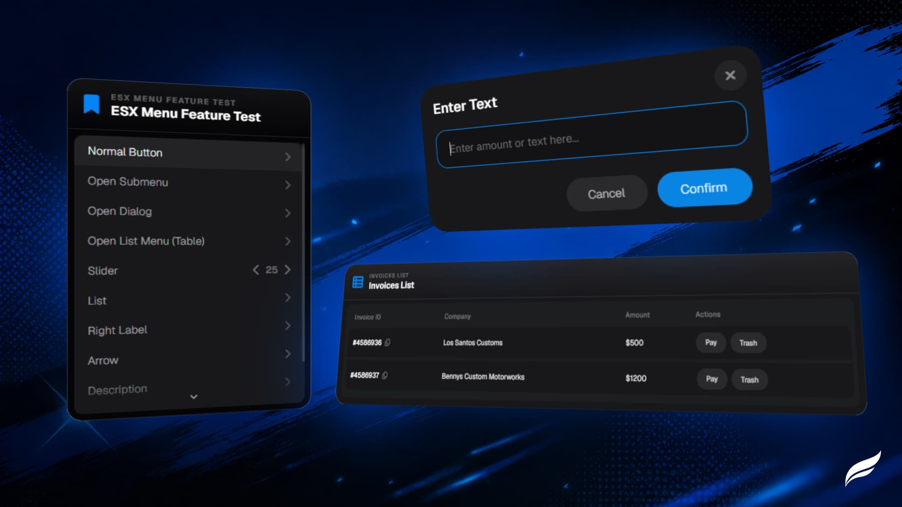

# swift_esx_menu

A modern, high-performance UI replacement for the classic ESX menu system in FiveM, combining the functionality of:
- `esx_menu_default`
- `esx_menu_dialog`
- `esx_menu_list`

into a single unified resource with a premium, sleek visual style.

ระบบเมนู UI รูปแบบใหม่ที่มีประสิทธิภาพสูงสำหรับระบบเมนู ESX ดั้งเดิมใน FiveM โดยการรวมความสามารถของ:
- `esx_menu_default`
- `esx_menu_dialog`
- `esx_menu_list`

เข้าไว้ด้วยกันในสคริปเดียว พร้อมกับสไตล์การออกแบบที่ทันสมัย สวยงาม และพรีเมียม

---

## English (EN)

### Key Features
- **Unified Resource**: Replaces three menus (`default`, `dialog`, `list`) with a single efficient resource.
- **Modern Responsive Design**: Clean and stunning card-based interfaces, custom-tailored color palettes, sleek transitions, and optimized typography.
- **Full Parity & Compatibility**: Drop-in replacement supporting all original ESX menu features, metadata fields, alignment choices, and callbacks
- **Hold-to-Scroll**: Seamless keyboard controls supporting rapid scrolling and navigation when keys are held down.
- **Scroll Shadow & Smooth Transitions**: Visual indicators for scrollable content and buttery-smooth animation transitions between pages/submenus.

### Installation
1. Remove the following resources from your `server.cfg`:
   - `esx_menu_default`
   - `esx_menu_dialog`
   - `esx_menu_list`
2. Add `ensure swift_esx_menu` to your `server.cfg`.

---

## ภาษาไทย (TH)

### คุณสมบัติเด่น
- **รวมเป็นหนึ่งเดียว**: เปลี่ยนแทนเมนูทั้งสามตัว (`default`, `dialog`, `list`) ด้วยสคริปเดียวที่ทำงานอย่างมีประสิทธิภาพ
- **การออกแบบที่สวยงามและทันสมัย (Responsive)**: หน้าต่างการใช้งานแบบการ์ดที่สะอาดตาและสวยงาม, จานสีที่คัดสรรมาเป็นอย่างดี, การเปลี่ยนผ่านที่ลื่นไหล และการจัดวางตัวอักษรที่ลงตัว
- **รองรับระบบเดิมเต็มรูปแบบ**: สามารถนำไปทดแทนของเดิมได้ทันที โดยรองรับฟังก์ชันเมนู ESX ดั้งเดิมทั้งหมด รวมถึงฟิลด์ metadata, การจัดตำแหน่ง (align) และ Callback ต่างๆ (`submit`, `cancel`, `change`)
- **กดค้างเพื่อเลื่อน**: ควบคุมด้วยคีย์บอร์ดได้อย่างลื่นไหล รองรับการเลื่อนและการนำทางอย่างรวดเร็วเมื่อกดปุ่มค้างไว้
- **Scroll Shadow & Smooth Transitions**: แสดงแถบเงาเมื่อมีเนื้อหาที่สามารถเลื่อนได้ และอนิเมชันการเปลี่ยนผ่านหน้าเมนู/เมนูย่อยที่ราบรื่น

### วิธีการติดตั้ง
1. ปิดการทำงานของสคริปเหล่านี้ใน `server.cfg`:
   - `esx_menu_default`
   - `esx_menu_dialog`
   - `esx_menu_list`
2. เพิ่ม `ensure swift_esx_menu` ลงใน `server.cfg`